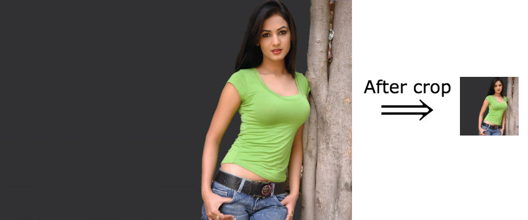
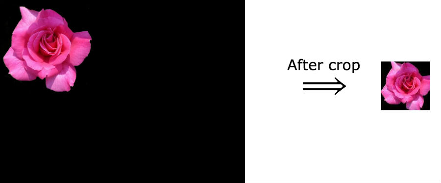
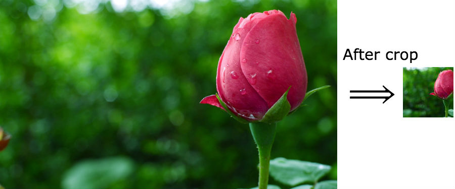

opticrop-node
=============

node.js port of [jueseph/Opticrop](https://github.com/jueseph/Opticrop)

Detect the most interesting part of picture and crops it

# Description
Unlike most cropping routines out there, Opticrop uses edge-detection to find the most “interesting” part of the image to crop, so you won’t get a useless thumbnail just because the top-left corner of your image happened to be a big patch of featureless sky.

# Limitations
Opticrop was written to be smarter than easily available alternatives, but because the strategy is relatively simple, it still makes the “wrong” crop on certain images.

[read more](https://diauxicshift.wordpress.com/2010/06/21/opticrop-content-aware-cropping-with-php-and-imagemagick/)


**Example #1** - *crops original image just fine*


**Example #2** - *the result is perfect*


**Example #3**  - *result is not as good as you probably expected*


## Installation
First install graphicsmagick and dev version od GD2 (more info [here](https://www.npmjs.com/package/node-gd))
-------------
# on Debian/Ubuntu
```
sudo apt-get install graphicsmagick
sudo apt-get install libgd2-xpm-dev
OR
sudo apt-get install libgd2-dev # libgd
npm install opticrop-node
```

# On RHEL/CentOS
```
$ sudo yum install gd-devel
npm install opticrop-node
```

# on Mac OS/X
```
brew install graphicsmagick
brew install pkg-config gd
npm install opticrop-node
```

**Will not build on Windows!**

# Example
```JavaScript
var Opticrop = require('opticrop-node').Opticrop;
var opticrop = new Opticrop;
opticrop.setImage('./images/example.jpg')
  .setWidth(100)
  .setHeight(100)
  .cropTo('./images/cropped_example.jpg', function(err, data) {
    console.log("Cropping done", err, data);
  });
```

# Test
Following command will crop example images and save as `images/cropped_example.(gif|jpg|png)`
```
node test.js
```

You also can check if there are memory leaks
```
TEST_MEMORY=1 node test.js
```

Version History
===============
1.0.0
-----
Rewritten in TypeScript

0.1.2
-----
Updated installation instructions
0.1.1
-----
Cropping speed was increased by 3 times due to replacing of mikolalysenko/get-pixels with mikesmullin/node-gd

0.1.0
-----
Ported version of [jueseph/Opticrop](https://github.com/jueseph/Opticrop)
